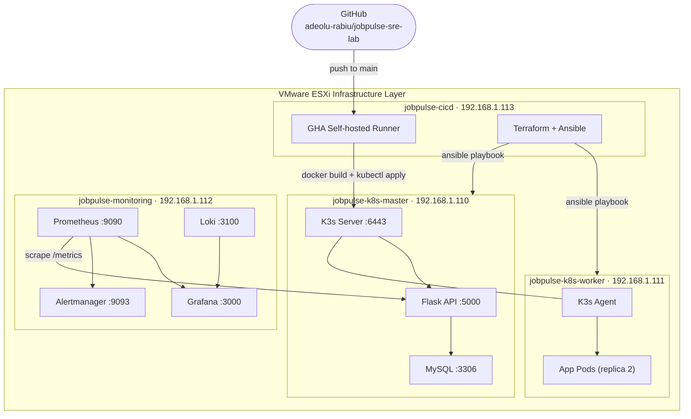

# JobPulse SRE Platform

**A production-grade Site Reliability Engineering platform demonstrating end-to-end observability, automated deployment, and infrastructure resilience for high-traffic web services.**

---

## Overview

JobPulse is a fully operational SRE platform built to demonstrate the engineering practices, tooling, and operational discipline required to run reliable, observable, and scalable services in modern enterprise and cloud-native environments.

The platform simulates a high-traffic job board API service with a complete reliability engineering stack: containerised microservices orchestrated by Kubernetes, a full three-pillar observability implementation covering metrics, logs, and distributed tracing, automated CI/CD delivery pipelines, and Infrastructure as Code provisioning. Every component reflects production SRE standards including SLO-based alerting, incident runbooks, automated rollback on deployment failure, and zero-touch infrastructure provisioning.

This platform demonstrates the operational maturity expected in environments where reliability directly affects user experience and business revenue at scale.

---

## Enterprise Value Proposition

| Capability | Business Impact |
|---|---|
| SLO-based alerting | Teams detect reliability degradation before users are affected, reducing customer-facing incidents |
| Automated CI/CD with rollback | Deployment failures are detected and reversed within 2 minutes, protecting production availability |
| Full observability stack | Mean time to resolution reduced through correlated metrics, logs, and traces in a single pane |
| Infrastructure as Code | Entire platform is reproducible in under 30 minutes, eliminating configuration drift and snowflake servers |
| Kubernetes workload management | Applications scale horizontally under load with zero-downtime rolling deployments |
| Centralised log aggregation | Audit trail and forensic capability across all services without manual log retrieval |
| Automated health validation | Every deployment is smoke-tested automatically before traffic is served |

Organisations operating digital platforms at scale face a consistent set of operational challenges: slow incident detection, manual and error-prone deployments, opaque system behaviour, and infrastructure that is difficult to reproduce or audit. JobPulse addresses each of these directly through engineering rather than process, producing a platform that is instrumented, automated, and operationally self-documenting from the ground up.

---

## Platform Architecture



---

## Technology Stack

### Application Layer
| Component | Technology | Purpose |
|---|---|---|
| API Service | Python Flask | RESTful job board API with native Prometheus instrumentation |
| Database | MySQL 8.0 | Relational data store with production-grade indexing and query optimisation |
| Container Runtime | Docker | Standardised application packaging and deployment units |

### Orchestration Layer
| Component | Technology | Purpose |
|---|---|---|
| Container Orchestration | Kubernetes (K3s) | Production-grade workload scheduling, scaling, and self-healing |
| Workload Distribution | K3s Server + Agent | Control plane separation from worker nodes, mirroring EKS architecture |
| Deployment Strategy | Rolling updates | Zero-downtime deployments with configurable surge and unavailability thresholds |
| Health Management | Liveness + Readiness probes | Automatic pod restart and traffic routing based on application health state |

### Observability Stack
| Component | Technology | Purpose |
|---|---|---|
| Metrics | Prometheus | Time-series metrics collection with PromQL-based SLO evaluation |
| Dashboards | Grafana | Unified observability dashboards with SLO tracking and drill-down capability |
| Log Aggregation | Loki + Promtail | Centralised structured log collection across all nodes and services |
| Distributed Tracing | OpenTelemetry | End-to-end request tracing across service boundaries |
| Alerting | Alertmanager | Multi-channel alert routing with deduplication and silence management |
| Infrastructure Metrics | Node Exporter | Host-level CPU, memory, disk, and network telemetry |

### Delivery and Automation Layer
| Component | Technology | Purpose |
|---|---|---|
| CI/CD Pipeline | GitHub Actions | Automated test, build, and deploy pipeline triggered on every push to main |
| Pipeline Runner | Self-hosted runner | Low-latency pipeline execution within the infrastructure boundary |
| Infrastructure as Code | Terraform | Declarative infrastructure provisioning with state management |
| Configuration Management | Ansible | Idempotent configuration enforcement across all nodes |
| Scripting | Python + Bash | Operational automation, health validation, and toil elimination |

### Infrastructure Layer
| Component | Technology | Purpose |
|---|---|---|
| Hypervisor | VMware ESXi 8.0 | Enterprise virtualisation platform providing isolated compute resources |
| Operating System | Ubuntu 24.04 LTS | Production Linux baseline with long-term security support |
| Firewall | UFW | Host-level network access control on all nodes |
| Security Hardening | Fail2ban + SSH key auth | Brute-force protection and password-less authentication enforcement |

---

## SRE Practices Implemented

### Service Level Objectives
The platform enforces measurable reliability targets with automated alerting on SLO burn rate:

- **Availability SLO:** 99.9% — alert fires when error rate exceeds 0.1% over a 5-minute window
- **Latency SLO:** p99 response time under 500ms — alert fires when exceeded for more than 5 minutes
- **Infrastructure SLO:** CPU below 80%, disk above 15% free — capacity headroom monitoring across all nodes

### Incident Management
Structured incident response is built into the platform:
- Alert rules defined in Prometheus with severity classification (warning / critical)
- Runbooks documented per alert type covering detect, triage, mitigate, and verify steps
- Post-incident log template for root cause analysis and action item tracking
- Rollback procedure automated: `kubectl rollout undo` triggered on smoke test failure

### Deployment Safety
Every deployment to the cluster goes through automated validation:
1. Unit tests must pass before build proceeds
2. Docker image is built and loaded into K3s
3. `kubectl rollout status` confirms successful rollout before smoke test
4. HTTP health endpoint verified post-deployment
5. Pipeline fails and deployment is rolled back automatically on any step failure

### Capacity Planning
Observability dashboards include trending views for:
- CPU and memory utilisation per node over time
- Request rate growth trends on the API
- Database connection pool and query latency trends
- Disk consumption trajectory across all nodes

### Toil Elimination
Automation covers the operational tasks that would otherwise consume engineering time:
- Infrastructure provisioning: single Ansible playbook run configures any new node to baseline state in under 5 minutes
- Deployment: zero manual steps from code commit to production
- Health reporting: scheduled health check script across all nodes with single command execution
- Certificate and secret management: Kubernetes Secrets with RBAC-controlled access

---

## Repository Structure

```
jobpulse-sre-lab/
├── app/                    # Flask API application
│   ├── app.py              # Application entrypoint with Prometheus instrumentation
│   ├── requirements.txt    # Python dependencies
│   ├── Dockerfile          # Container image definition
│   └── tests/              # Unit test suite
├── db/
│   └── schema.sql          # Database schema with indexes
├── k8s/                    # Kubernetes manifests
│   ├── namespace.yaml
│   ├── api-deployment.yaml # API deployment with probes and resource limits
│   └── mysql-deployment.yaml
├── monitoring/             # Observability stack
│   ├── prometheus.yml      # Scrape configuration and alertmanager integration
│   ├── alert_rules.yml     # SLO-based alert definitions
│   └── docker-compose.yml  # Monitoring stack deployment
├── cicd/                   # Pipeline configuration
│   └── .github/workflows/deploy.yml
├── terraform/              # Infrastructure as Code
├── ansible/                # Configuration management
│   ├── inventory.ini
│   └── base-setup.yml
├── scripts/
│   ├── health_check.sh     # Multi-node health reporter
│   ├── deployment_health.py # Post-deployment validation
│   └── locustfile.py       # Load testing configuration
└── docs/
    ├── runbook-high-error-rate.md
    └── post-incident-log.md
```

---

## Deployment Pipeline

Every push to `main` triggers the following automated sequence:

```
Code Push to GitHub
        │
        ▼
┌─────────────────┐
│   Run Tests     │  pytest unit tests — pipeline stops here on failure
└────────┬────────┘
         │
         ▼
┌─────────────────┐
│   Build Image   │  docker build → tag with commit SHA → load into K3s
└────────┬────────┘
         │
         ▼
┌─────────────────┐
│ Deploy to K3s   │  kubectl apply → rollout restart → rollout status
└────────┬────────┘
         │
         ▼
┌─────────────────┐
│  Smoke Test     │  HTTP GET /health → assert 200 → pipeline passes
└────────┬────────┘
         │
    PASS │ FAIL
         │    └──► kubectl rollout undo → alert
         ▼
  Production Live
```

---

## Getting Started

### Prerequisites
- VMware ESXi 7.0 or higher with minimum 16GB RAM and 200GB free storage
- Four Ubuntu 24.04 LTS VMs provisioned and reachable over the network
- SSH key authentication configured from the control machine to all nodes
- GitHub account with a personal access token or SSH key configured

### Quick Start

```bash
# Clone the repository
git clone git@github.com:adeolu-rabiu/jobpulse-sre-lab.git
cd jobpulse-sre-lab

# Run base configuration across all nodes
ansible-playbook -i ansible/inventory.ini ansible/base-setup.yml

# Install K3s cluster
bash scripts/install_k3s.sh

# Deploy the application
kubectl apply -f k8s/

# Deploy observability stack
cd monitoring && docker compose up -d

# Verify platform health
bash scripts/health_check.sh
python3 scripts/deployment_health.py
```

---

## Observability Dashboards

| Dashboard | URL | Purpose |
|---|---|---|
| Grafana | http://192.168.1.114:3000 | Unified metrics, logs, SLO tracking |
| Prometheus | http://192.168.1.114:9090 | Raw metrics, alert state, target status |
| Alertmanager | http://192.168.1.114:9093 | Active alerts, silences, routing |
| JobPulse API | http://192.168.1.110:30500 | Application endpoint |
| API Metrics | http://192.168.1.110:30500/metrics | Raw Prometheus exposition |

---

## Load Testing

Run a simulated load test against the platform to validate SLO compliance under traffic:

```bash
# 50 concurrent users for 60 seconds
locust -f scripts/locustfile.py \
  --host=http://192.168.1.110:30500 \
  --users 50 --spawn-rate 5 \
  --run-time 60s --headless
```

Expected results under load: error rate below 1%, p99 latency below 500ms.

---

## Author

**Adeolu Rabiu**
Site Reliability Engineer | Cloud Infrastructure | DevOps

- Email: adeolu.rabiu@gmail.com
- Phone: +44 7578 928 667
- GitHub: [github.com/adeolu-rabiu](https://github.com/adeolu-rabiu)
- LinkedIn: [linkedin.com/in/adeolurabiu](https://linkedin.com/in/adeolurabiu)

---

## Licence

MIT License. See LICENSE file for details.

